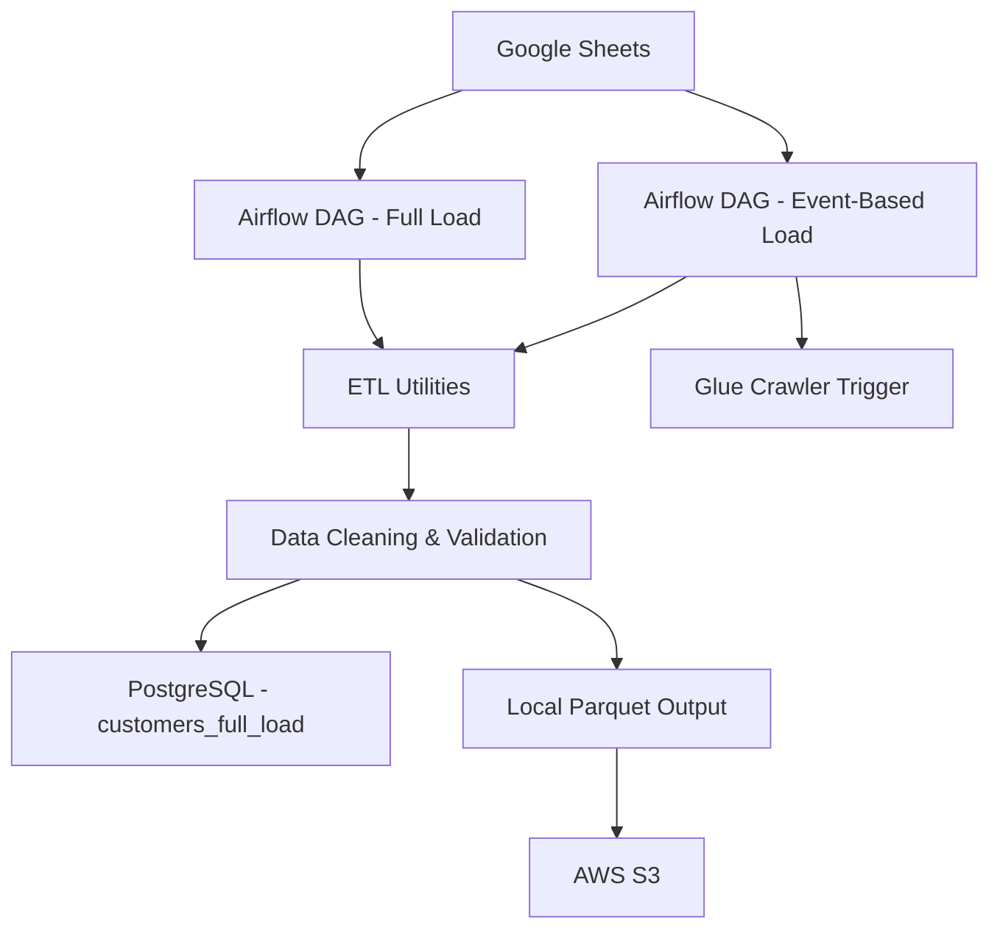

# Data Engineering Pipeline with Airflow, Google Sheets, PostgreSQL, and AWS S3

## Project Overview

This project implements a production-style data engineering pipeline that automates the extraction, transformation, loading, and storage of customer-related data from Google Sheets into a relational database and cloud storage. The solution is orchestrated with Apache Airflow, containerized with Docker, and designed to support both full-load and incremental event-based ingestion workflows.

The pipeline demonstrates a practical end-to-end ETL use case for modern data engineering, combining data collection, data cleaning, database integration, cloud storage, and workflow automation in one cohesive solution.

---

## Project Objective

The main objective of this project is to build a reliable and scalable ETL pipeline that:

- Ingests data from Google Sheets into a structured data platform
- Cleans and validates raw customer data before storage
- Supports both:
  - Full historical loads
  - Incremental loads based on newly added rows
- Stores processed data in PostgreSQL for reporting and analytics
- Stores Parquet files in AWS S3 for scalable cloud storage
- Automates the workflow using Apache Airflow

This project is suitable for showcasing data engineering capabilities in a GitHub portfolio, especially for ETL automation, API integration, cloud storage, and workflow orchestration.

---

## Data Pipeline Architecture

The architecture follows a classic batch-oriented ETL pattern:

1. Data is extracted from Google Sheets using the Google Sheets API
2. Data is transformed through Python-based cleaning and normalization steps
3. Data is loaded into PostgreSQL
4. A Parquet copy is saved locally and uploaded to AWS S3
5. Airflow orchestrates the process on a scheduled or manual basis



---

## Technologies Used

| Category | Technologies |
|---|---|
| Orchestration | Apache Airflow |
| Programming Language | Python |
| Data Processing | pandas, pyarrow |
| Database | PostgreSQL, SQLAlchemy |
| Cloud Storage | AWS S3 |
| External Data Source | Google Sheets API |
| Authentication | Google Service Account |
| Containerization | Docker, Docker Compose |
| Configuration | YAML |
| Testing | pytest |

---

## Workflow Explanation

The project contains two main ETL workflows:

- Full Load Pipeline
  - Designed to process all available data from the configured Google Sheets
  - Suitable for initial ingestion or complete refresh

- Incremental / Event-Based Pipeline
  - Detects newly added rows in the source sheets
  - Avoids reprocessing rows that have already been ingested
  - Uses Airflow Variables as row watermarks to track progress

This design improves efficiency and ensures that repeated runs do not duplicate existing records.

---

## Airflow DAG Explanation

The repository contains several DAGs:

- full_excel_load
  - Executes the complete ETL process
  - Runs manually
  - Performs extraction, transformation, local Parquet generation, S3 upload, and PostgreSQL loading

- event_based_load
  - Runs every 15 minutes
  - Checks for new rows in Google Sheets
  - Loads only newly detected records
  - Stores incremental progress using Airflow Variables

- simple_pipeline
  - A minimal example DAG used as a basic workflow demonstration

- test_dag
  - A simple test DAG for validating Airflow DAG definition behavior

---

## Data Extraction, Transformation, and Loading Process

### Extraction
The ETL logic connects to Google Sheets using a service account and retrieves sheet data via the Google Sheets API. The pipeline reads all sheets from the configured spreadsheet and skips unwanted sheets based on configuration.

### Transformation
The transformation layer performs the following operations:

- Standardizes column names
- Maps source data into a canonical schema
- Cleans mobile numbers
- Normalizes Arabic text
- Removes invalid or incomplete records
- Removes duplicate rows
- Adds metadata such as upload date and processing timestamp

### Loading
Processed data is loaded into:

- PostgreSQL table: customers_full_load
- Local Parquet file in the output directory
- AWS S3 bucket as a Parquet object

---

## Data Cleaning and Validation Steps

Several quality checks are implemented to ensure the data is usable for downstream analytics:

- Mobile number cleaning
  - Non-numeric characters are removed
  - Jordanian numbers without country code are converted to the format 962...
  - Invalid values are removed

- Grade cleaning
  - The value غير معرف is removed
  - The value عاشر is mapped to 2010

- Arabic normalization
  - Tashkeel is removed
  - Arabic letters are normalized for consistency
  - Common orthographic variations are standardized

- Duplicate removal
  - Duplicate records are dropped to avoid redundant data

- Row filtering
  - Rows with missing or invalid essential values are skipped

These steps make the dataset more consistent and ready for storage and analysis.

---

## Database Integration

PostgreSQL is used as the primary analytical database for the pipeline.

### Database behavior
- The full load writes data into the table customers_full_load
- The incremental load appends new records to the same table
- The pipeline uses SQLAlchemy and psycopg2 for database connectivity

This setup makes the data available for BI tools, reporting, dashboards, or further transformation workflows.

---

## Cloud Storage Integration

AWS S3 is used to store the processed Parquet files.

### Cloud flow
- The full-load process writes a local Parquet file
- The file is uploaded to S3 using boto3
- The event-based pipeline also uploads incremental Parquet files for each run

The S3 integration allows the project to preserve data snapshots in a durable and scalable cloud object store.

A Glue crawler is also triggered after event-based ingestion, supporting metadata discovery and future catalog-based analytics workflows.

---

## Docker Setup

The project is fully containerized using Docker Compose.

### Services included
- PostgreSQL database
- Apache Airflow webserver
- Apache Airflow scheduler
- Airflow initialization service
- Metabase

### Benefits
- Consistent development and deployment environment
- Easy setup for local execution
- Simplified dependency management

---

## Project Folder Structure

```text
airflow-pipeline1/
├── airflow/
│   ├── dags/
│   │   ├── event_based_load.py
│   │   ├── excel_load.py
│   │   ├── simple_pipeline.py
│   │   └── test_dag.py
│   ├── etl/
│   │   ├── etl_utils.py
│   │   └── event_load.py
│   └── logs/
├── config/
├── data/
├── tests/
├── config.yaml
├── docker-compose.yml
├── Dockerfile
├── requirements.txt
└── README.md
```

---

## How to Run the Project

1. Clone the repository
2. Ensure Docker and Docker Compose are installed
3. Build and start the containers:

```bash
docker compose up --build
```

4. Access the services:
   - Airflow UI: http://localhost:8080
   - Metabase: http://localhost:3000
   - PostgreSQL: localhost:5432

5. Trigger the relevant DAGs from the Airflow UI:
   - full_excel_load for a full ingestion
   - event_based_load for incremental processing

---

## Pipeline Execution Flow

### Full Load Execution
- Fetch data from Google Sheets
- Build a DataFrame from all sheets
- Apply cleaning and transformation
- Save a Parquet file
- Upload to S3
- Load into PostgreSQL

### Incremental Execution
- Read the current sheet state
- Compare to the stored watermark
- Identify newly added rows
- Process only those new rows
- Append them to PostgreSQL
- Upload incremental Parquet files to S3
- Trigger the Glue crawler

---

## Challenges and Solutions

### Challenge 1: Inconsistent source data
Google Sheets data contained formatting variability and inconsistent values.

Solution:
- Implemented normalization logic for Arabic text
- Standardized mobile numbers and grades
- Applied structural mapping to a canonical schema

### Challenge 2: Duplicate or invalid records
The source data included invalid mobile values and duplicate rows.

Solution:
- Filtered invalid entries
- Removed duplicates before storage
- Ensured only valid records reached the database

### Challenge 3: Incremental processing without reloading existing rows
Repeated runs could reprocess the same data.

Solution:
- Used Airflow Variables as row-count watermarks
- Tracked sheet progress and loaded only newly detected rows

### Challenge 4: Multi-platform integration
The project needed to connect Google Sheets, PostgreSQL, AWS S3, and Airflow in one workflow.

Solution:
- Centralized configuration in YAML
- Used Python ETL utilities and Docker Compose for orchestration and portability

---

## Future Improvements

Potential enhancements for future versions of the project include:

- Add automated data quality tests and validation checks
- Introduce dbt models for transformation and analytics
- Add monitoring and alerting for DAG failures
- Implement CI/CD for deployment automation
- Use a dedicated data warehouse instead of PostgreSQL for larger-scale workloads
- Add logging and metadata tracking for better observability
- Support more source systems beyond Google Sheets

---

## Conclusion

This project demonstrates a complete and practical data engineering pipeline built around Airflow, Python, PostgreSQL, AWS S3, and Google Sheets. It showcases key ETL concepts such as data extraction, cleaning, validation, orchestration, and cloud storage integration in a real-world workflow.

By combining automation, transformation logic, and cloud integration, this project serves as a strong example of modern data engineering practices and is well-suited for a professional GitHub portfolio.
